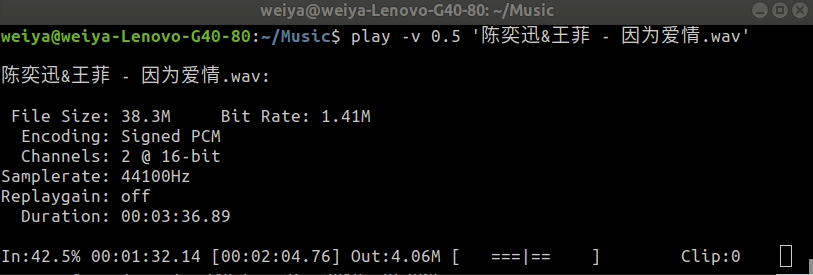
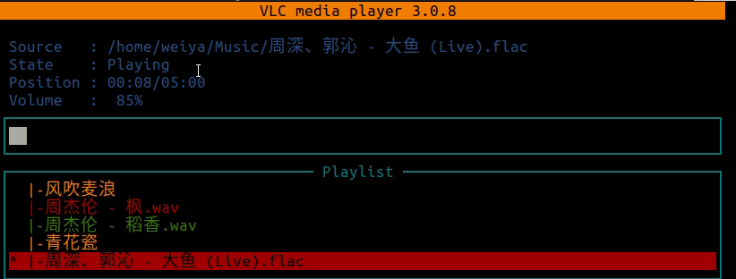

# 笔记本作为服务器

有一台旧的笔记本电脑，Lenovo G40，刷了 Ubuntu 18.04，一直放在寝室吃灰，之前有段时间还试着将其当做周日在寝室办公的机器，但是相较于目前的 ThinkPad T460p，性能还是远不及的，打开软件的速度明显慢了很多。这次疫情待在家里，在摸索科学上网的几种途径后，觉得完全可以将其改成一台服务器。当然这个想法之前不是没有，但是因为想到没有 ip 地址，怎么能访问呢。当熟悉了 ssh 内网穿透以及 ngrok 这些工具之后，这些都变得不是事儿。

## SSH 远程登录

将系里服务器作为跳板机

```bash
weiya@G40 $ autossh -M 33000 -o "StrictHostKeyChecking=false" -o "ServerAliveInterval 10" -o "ServerAliveCountMax 3" -NR 30003:localhost:22 SID@SERVER
T460p $ ssh -L 30003:localhost:30003 SID@SERVER
T460p $ ssh -p 30003 weiya@127.0.0.1
```

复制的话也变得很简单了，

```bash
T460p $ ssh -P 30003 file weiya@127.0.0.1:
```

## 禁止合盖休眠

既然作为服务器了，没必要继续直接操作了，于是想合上盖子，但是会自动进入休眠状态（准确说是 suspend，而不是 hibernate），这时连接便都断开了。但是在设置界面也没找到直接关闭休眠的，最后在 [How to Change Lid Close Action in Ubuntu 18.04 LTS](https://tipsonubuntu.com/2018/04/28/change-lid-close-action-ubuntu-18-04-lts/) 中找到解决方案，

```bash
sudo vi /etc/systemd/logind.conf
```

commenting out `HandleLidSwitch=suspend` and changes it to `HandleLidSwitch=ignore`

最后需要 

```bash
systemctl restart systemd-logind.service
```

没想到这个也能使连接断开，于是需要继续连接一遍。


## 音乐播放器

目标：通过 ssh 远程打开音乐，但是仍在 G40 上播放，而不是像图象一样 forward 到本地播放。

本来一开始担心会像图象一样，需要通过类似 `-X` 这种选项来支持这种功能，如果支持了，下一步还要看看怎么直接在服务器端直接播放，而不是额外占用本地的资源来播放，要不然我干脆用本机的音乐播放器就完事了。

幸好，图象和音频不一样，如 [Playing a remote movie on the remote computer](https://unix.stackexchange.com/questions/76751/playing-a-remote-movie-on-the-remote-computer) 所说，

> Linux manages sound and display differently. You normally only get access to the screen if you've logged in locally, whereas sound is often available to all processes running on the system.

所以打消了我的顾虑，下一步便是直接播放了。刚好 G40 有一首下载好的歌曲，然后试了一下用 `aplay` 打开，但是非常嘈杂，根本不是音乐。

然后便下了个网易云客户端，本来以为音乐会在服务器端播放，但是没有任何声音，而且报错

> vlcpulse audio output error: PulseAudio server connection failure: Connection refused

再结合一下 `aplay` 的不正常播放，误以为 `PulseAudio` 出现了问题，所以按照 [PulseAudio server connection failure: Connection refused (debian stretch)](https://unix.stackexchange.com/questions/445386/pulseaudio-server-connection-failure-connection-refused-debian-stretch/567083) 操作一遍，似乎并没有什么问题。但是因为这个涉及到重启，所以提醒了我一个很重要的点，即自登陆自连接。

后来意识到 `aplay` 只能播放 `wav` 文件，而 `.mp3`需要其他的播放命令，比如 `mpg123`，参考 [How to play mp3 files from the command line?](https://askubuntu.com/questions/115369/how-to-play-mp3-files-from-the-command-line)

后来试了下 `sox`，声称可以支持多种格式，

```bash
$ sudo apt-get install sox
$ sudo apt-get install libsox-fmt-all
```

播放的界面很清爽但不简单，



其中 `-v 0.5` 调节音量。

!!! tip "音乐下载"
    - [超高无损音乐](https://www.sq688.com/)

先暂时写了个简单的列表顺序播放的脚本 

```bash
$ cat playmusic.sh 
#!/bin/bash
for music in ~/Music/*; do
	if [[ -f $music ]]; then
		play -v 0.35 "$music"
	fi
done
```

但是如果想关掉，只能 `Ctrl-C` 了，而且要连续 `Ctrl-C` 了。其实主要的是并不支持所有格式，比如`.ape`，然后我便试了试 `nvlc`, [Ubuntu documentation: PlayMusicFromCommandLine](https://help.ubuntu.com/community/PlayMusicFromCommandLine) 列出了几种可能的从终端播放音乐的方法。

注意 `nvlc` 不需要预装 `vlc`，只需要

```bash
$ sudo apt-get install vlc-bin
```

因为一开始误以为是 vlc 自带的，但是装了 vlc 之后，

```bash
$ sudo snap install vlc
```

并没有 `nvlc`，而直接敲 `nvlc` 就可以拿到提示，

```bash
$ nvlc

Command 'nvlc' not found, but can be installed with:

sudo apt install vlc-bin
```

安装好之后，直接 `vlc *` 便可以顺序播放所有歌曲，




关键是其功能远不如此，完全就是一个音乐播放器了，比如通过 `a, z` 键调节音量，更多功能键入 `h` 获取帮助，而且支持 `.ape` 格式！
## 自登录自连接

因为重启后，一般会出现登录界面，需要输入用户名及密码。将 `/etc/gdm3/custom.conf` 中的这两行

```bash
#  AutomaticLoginEnable = true
#  AutomaticLogin = user1
```

改成 

```bash
AutomaticLoginEnable = true
AutomaticLogin = weiya
```

下一步还需要自动发起 ssh 连接至跳板服务器，这个可以再 `.profile` 中添加

```bash
$ echo "./autossh2ln001.sh" >> .profile
```

不过需要注意到如果存在 `.bash_profile` 或 `.bash_login`，则需要更改这些文件，因为只按顺序调用这三个的第一个。

因为音乐文件是通过本地百度云下载的，所以需要复制过去，但是如果 `scp` 的话，似乎没有选项支持 disable overwrite，然后看到 [scp without replacing existing files in the destination](https://unix.stackexchange.com/questions/14191/scp-without-replacing-existing-files-in-the-destination)，推荐 `rsync`，增量更新，想起上次在 pluskid 的博客中也看到了，所以便准备用它，不过 ssh 的端口需要额外指定，[Is it possible to specify a different ssh port when using rsync?](https://stackoverflow.com/questions/4549945/is-it-possible-to-specify-a-different-ssh-port-when-using-rsync)，最后的命令为

```bash
$ rsync -auv -e "ssh -p 30003" /home/weiya/OneDrive/CloudMusic/ weiya@127.0.0.1:~/Music/
```

## Mount Windows from Terminal

参考 [How to Mount Windows Partitions in Ubuntu](https://www.tecmint.com/mount-windows-partition-in-ubuntu/)

```bash
sudo mkdir /media/weiya/WIN
sudo mount -t ntfs-3g -o ro /dev/sda4 /media/weiya/WIN
```

其中 `/dev/sda4` 是通过 `sudo lsblk` 确定的。

## Boot into Text mode

参考 [Boot into Text Mode and Login Automatically](http://ubuntuguide.net/boot-into-text-mode-and-login-automatically)

虽然之前通过设定 `.profile` 实现了重启后自动连接，但是后来某一次重启后，准确说是断电重启后，`autossh2ln001` 程序并没有运行成功，而是报出 `unknown host` 之类的错误，也就是 `ln001` 服务器的域名解析出现问题，但是当进入桌面后，收到重新运行 `autossh2ln001`，一切正常，搞不清哪里出现了问题。

而且注意到每次重启并没有直接进入桌面，而且似乎是首先运行 `.profile` 里面的命令才进入桌面，而可能因为我没加后来运行的 `&` 符号，导致运行成功后一直挂起，没有进入桌面（呈现状态是 Ubuntu 的 logo 底下的几个小点的明暗循环变化），而倘若失败（也就是报出 `unknown host` 的错误），则可以顺利进入桌面。

所以索性不要以图形界面启动了，这个可以通过修改 `/etc/default/grub` 实现，

```bash
# GRUB_CMDLINE_LINUX_DEFAULT="quiet splash"
GRUB_CMDLINE_LINUX_DEFAULT="text"
```

修改后运行 `sudo update-grub`

而 text 模式下免密码登录直接修改 `/etc/init/tty1.conf`

```bash
# exec /sbin/getty -8 38400 tty1
exec /sbin/getty -8 38400 tty1 -a weiya
```

这个跟上文修改 `/etc/gdm3/custom.conf` 实现自登录应该不一样，因为 `gdm3` 是跟图形界面有关的程序。

!!! tip "display managers"
	`gdm3`, `kdm`, `lightdm` 都是 [display managers](https://en.wikipedia.org/wiki/X_display_manager)., 参考 [What is gdm3, kdm, lightdm? How to install and remove them?](https://askubuntu.com/questions/829108/what-is-gdm3-kdm-lightdm-how-to-install-and-remove-them)

最后， `unknown host` 的问题也没有再报出了。

如果要从 text mode 回到图形界面

```bash
sudo lightdm
```

但是很奇怪的一点是，以后每次重启后，都会进入到图形界面，不过启动过程确实是 text 的。

## 电量查询

上文提到笔记本耗电完重启，这是因为其配套的充电器充不进电，当换成当前笔记本的适配器后（功率略高一些），虽然仍充不进电，但是能够一直保持电量，一直都是 10% 左右，倘若换成其配套的充电器，很快就会自动关机了。所以想到要不[查看一下电池状态](https://www.imooc.com/article/29599)，一查吓一跳，原来电池已经快被榨干了，

```bash
$ upower -i `upower -e | grep 'BAT'`
  native-path:          BAT0
  vendor:               Lenovo IdeaPad
  serial:               BAT20101001
  power supply:         yes
  updated:              2020年08月25日 星期二 16时21分10秒 (0 seconds ago)
  has history:          yes
  has statistics:       yes
  battery
    present:             yes
    rechargeable:        yes
    state:               charging
    warning-level:       none
    energy:              0.97 Wh
    energy-empty:        0 Wh
    energy-full:         9.79 Wh
    energy-full-design:  37.5 Wh
    energy-rate:         0 W
    voltage:             13.974 V
    percentage:          9%
    capacity:            26.1067%
    icon-name:          'battery-caution-charging-symbolic'
```

试着解读一下信息，现在电池最大容量已经耗到最初的 26.1067%，而当前一直充电时还只能达到这个的 9%，也就是 `0.261067*0.09 = 0.02349603`。

## 拔掉电源自动关机

参考 [https://askubuntu.com/questions/854570/how-to-shutdown-automatically-when-ac-power-is-not-available](How to shutdown automatically when AC power is not available)

新建

```bash
sudo vi /etc/udev/rules.d/50-ac-unplugged.rules
```

然后写入

```bash
SUBSYSTEM=="power_supply", ENV{POWER_SUPPLY_ONLINE}=="0", RUN+="/sbin/shutdown now"
```

保存文件并运行

```bash
sudo udevadm control --reload-rules
```

拔掉电源后确实自动关机了！！

## 插上电源自动开机

这个似乎[需要 BIOS 设置](https://superuser.com/questions/984934/i-want-my-pc-to-turn-on-automatically-when-power-is-connected)，而且是在 Power Management Setup 中进行，但是通过 `Fn+F2` 进入 BIOS 后，并没有这个菜单，可能还是不支持吧。不过话说回来这个功能没有自动关机那么必要。

