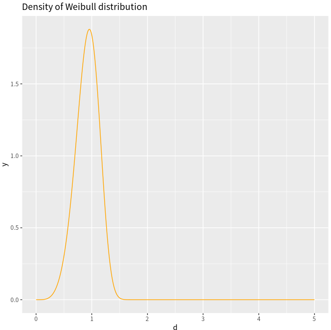
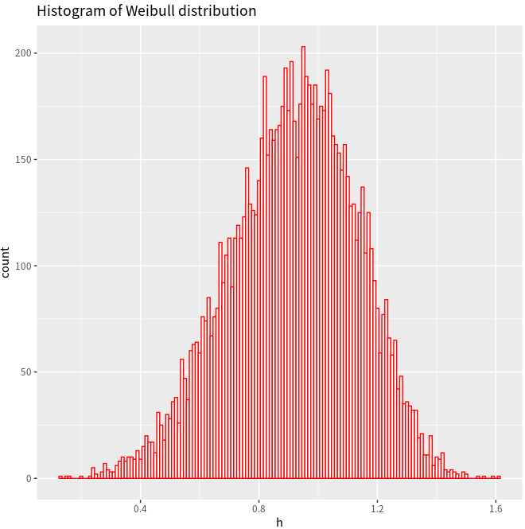
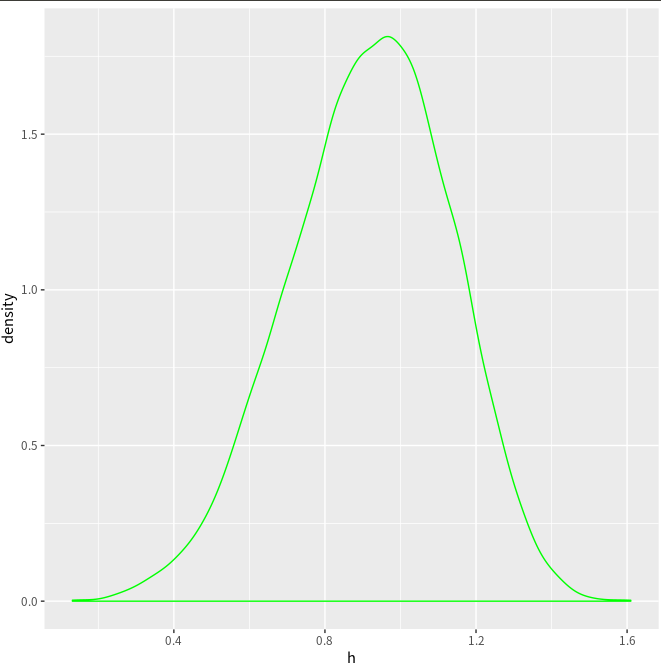
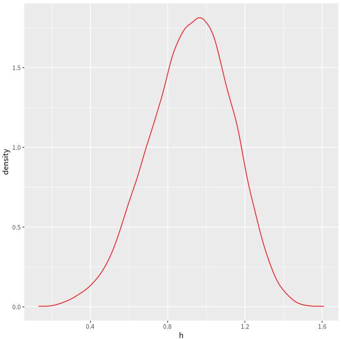

# ggplot 相关

## ggplot同时绘制多个密度图

参考[使用ggplot2同时绘制多个密度图](https://www.tuicool.com/articles/3aUnem7)

```r
plots <- NULL
for(i in colnames(train)){ 
    plots[[i]] <- ggplot(train) + 
    geom_density(aes_string(x = i, fill = 'is_black'), alpha = 0.5, show.legend = F) + 
    xlab("") + 
    ylab(""); 
}
plot_grid(plotlist = plots)
```

## ggplot绘制概率密度图

adapted from [ggplot2绘制概率密度图](http://www.cnblogs.com/wwxbi/p/6142410.html)

Take the Weibull distribution as an example, 

$$
f(x) = \begin{cases}
\frac k\lambda \left(\frac x\lambda\right)^{k-1}e^{-(x/\lambda)^k} & x\ge 0\\
0 & x < 0
\end{cases}
$$

where $\lambda > 0$ is the scale parameter, and $k > 0$ is the shape parameter. And

- if $k=1$, it becomes to the exponential distribution
- if $k=2$, it becomes to the Rayleigh distribution.

```r
d <- seq(0, 5, length.out=10000)
y <- dweibull(d, shape=5, scale=1, log = FALSE)
df <- data.frame(x=d,y)
ggplot(df, aes(x=d, y=y)) + 
    geom_line(col = "orange") + 
    ggtitle("Density of Weibull distribution")
```

{: style="height:40%;width:40%"}

```r
h = rweibull(10000, shape=5, scale=1)
ggplot(NULL, aes(x=h)) + 
    geom_histogram(binwidth=0.01, fill="white", col="red") + 
    ggtitle("Histogram of Weibull distribution")
```

{: style="height:40%;width:40%"}

```r
ggplot(NULL, aes(x=h)) + geom_density(col = "green")
```

{: style="height:40%;width:40%"}

```r
ggplot(NULL, aes(x=h)) + geom_line(stat = "density", col = "red")
```

A minor difference is that here is a horizontal line in the above estimated density.

{: style="height:40%;width:40%"}

Also refer to [Plotting distributions (ggplot2)](http://www.cookbook-r.com/Graphs/Plotting_distributions_(ggplot2)/)

## legend设置

参考[Legends (ggplot2)](http://www.cookbook-r.com/Graphs/Legends_(ggplot2)/)

### 默认情形

```r
library(ggplot2)
bp <- ggplot(data=PlantGrowth, aes(x=group, y=weight, fill=group)) + geom_boxplot()
bp
```

### 自定义图例的顺序

首先移除掉默认图例，有三种方式实现：
```r
# Remove legend for a particular aesthetic (fill)
bp + guides(fill=FALSE)

# It can also be done when specifying the scale
bp + scale_fill_discrete(guide=FALSE)

# This removes all legends
bp + theme(legend.position="none")
```

再改变默认顺序

```r
bp + scale_fill_discrete(breaks=c("trt1","ctrl","trt2"))
```

### 颠倒图例的顺序

```r
# These two methods are equivalent:
bp + guides(fill = guide_legend(reverse=TRUE))
bp + scale_fill_discrete(guide = guide_legend(reverse=TRUE))

# You can also modify the scale directly:
bp + scale_fill_discrete(breaks = rev(levels(PlantGrowth$group)))
```

### 隐藏图例标题

```r
# Remove title for fill legend
bp + guides(fill=guide_legend(title=NULL))

# Remove title for all legends
bp + theme(legend.title=element_blank())
```

### 自定义图例的标题及名称

两种方式，一种
另一种修改数据集

```r

```

### 图例的整体形状

```r
# Title appearance
bp + theme(legend.title = element_text(colour="blue", size=16, face="bold"))

# Label appearance
bp + theme(legend.text = element_text(colour="blue", size = 16, face = "bold"))
```

图例盒子

```r
bp + theme(legend.background = element_rect())
bp + theme(legend.background = element_rect(fill="gray90", size=.5, linetype="dotted"))
```

图例位置

```r
bp + theme(legend.position="top")

# Position legend in graph, where x,y is 0,0 (bottom left) to 1,1 (top right)
bp + theme(legend.position=c(.5, .5))

# Set the "anchoring point" of the legend (bottom-left is 0,0; top-right is 1,1)
# Put bottom-left corner of legend box in bottom-left corner of graph
bp + theme(legend.justification=c(0,0), legend.position=c(0,0))

# Put bottom-right corner of legend box in bottom-right corner of graph
bp + theme(legend.justification=c(1,0), legend.position=c(1,0))
```

### 隐藏图例的slashes

```r
# No outline
ggplot(data=PlantGrowth, aes(x=group, fill=group)) +
    geom_bar()

# Add outline, but slashes appear in legend
ggplot(data=PlantGrowth, aes(x=group, fill=group)) +
    geom_bar(colour="black")

# A hack to hide the slashes: first graph the bars with no outline and add the legend,
# then graph the bars again with outline, but with a blank legend.
ggplot(data=PlantGrowth, aes(x=group, fill=group)) +
    geom_bar() +
    geom_bar(colour="black", show.legend=FALSE)
```

## Treemaps

源于[碎片化的饼图是如何制作出来的，能否用excel或者R实现？ | 知乎](https://www.zhihu.com/question/267353430)

目前查阅到的有参考价值的为treemap和treemapify，但似乎都只针对矩形，对于原知乎问题中的圆形碎片化尚不能实现，目前想法是阅读这两个package的源代码，看能否找到突破口。

## 数学公式

比如

```r
expression(R[group("", list(hat(F),F),"")]^2)
```

参考

1. [Mathematical Annotation in R](http://vis.supstat.com/2013/04/mathematical-annotation-in-r/)

## 坐标轴标签字体大小

参考[Size of labels for x-axis and y-axis ggplot in R](https://stackoverflow.com/questions/14363804/size-of-labels-for-x-axis-and-y-axis-ggplot-in-r)

## 多张图片

`par(mfrow=c(1,2))`不起作用，要用到 `gridExtra` 包，如

```r
library(gridExtra)
plot1 <- qplot(1)
plot2 <- qplot(1)
grid.arrange(plot1, plot2, ncol=2)
```

参考[Side-by-side plots with ggplot2](https://stackoverflow.com/questions/1249548/side-by-side-plots-with-ggplot2)

## 绘制地图

参考

1. [Making Maps with R](http://eriqande.github.io/rep-res-web/lectures/making-maps-with-R.html)

## `scale_fill_manual` 和 `scale_color_manual`

更改颜色命令为

```r
scale_fill_manual(values = c("red", "blue"))
```

## save 

NOT `png()...dev.off()`, use

```r
ggsave("sth.eps",device="eps", width=9)
```

## `aes_string` vs `aes`

在重复绘图时，似乎是作用域的缘故，有时 `aes` 只能保留最后一个，此时需要用 `aes_string`.

参考 [Question: Continuously add lines to ggplot with for loop](https://www.biostars.org/p/234142/)