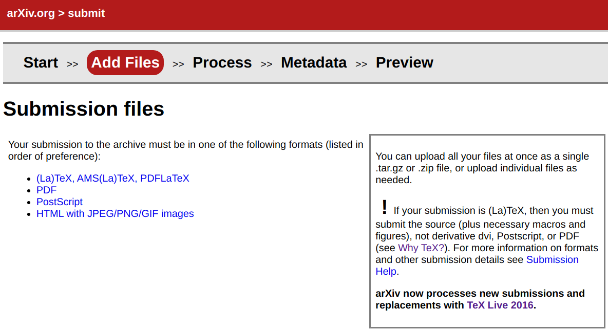

# 提交至 arXiv

记录下提交 tex 源文件到 arXiv 上踩过的坑。

首先，在 `Add Files` 说提交的文件可以是 tex 或 pdf，



因为老板说先不把 appendix 放进去，所以在本地生成好 pdf 文件，然后按照下列命令

```bash
$ pdftk full-pdf.pdf cat 1-30 output outfile.pdf
```

进行剪切，再上传，然后大概说这不是 tex 产生的文件，并且说 partially rejected 之类的，不能进行下去了。本以为可能是剪切的原因。后来本地手动把 appendix tex 去掉，编译生成新的 pdf，再进行上传，还是说 partially rejected 之类的。所以大概还真的如网友所说的，只能传 tex 吧。只是如果这样，干嘛要写其它可能性？！

后面就乖乖传 tex，然而 arxiv 支持的版本只有 TeXLive2016，而且竟然要自己上传 biber 编译好的 `.bbl` 文件，所以第一次报出的错误是版本不匹配，说期待 biber 2.8，而我本地上次更新装了 TeXLive 2020，其中 biber 是 2.14。后来翻了几个服务器，要么根本不是装的 texlive，要么是我后来手动装的 TeXLive 2018。而装一个 texlive 的时间令人难以忘记，即便现在网速比较好，也不容乐观，而且发现存有[旧版本 texlive](https://www.tug.org/historic/) 的镜像似乎只有 US、FR 等地孤零零的那几个，而不像最新版本那样世界各地都有镜像，估摸着网速不会怎么样。

首先想试试能不能直接降低 biber 的版本，也确实可以直接[从 github 单独安装 biber](https://github.com/plk/biber)，然而一开始从 [SourceForge](https://sourceforge.net/projects/biblatex-biber/files/biblatex-biber/2.8/) 下载了 `.tar.gz` 的源文件，下载之后 `bin/biber` 并用不了，且报错，

> Can't locate Biber.pm in @INC

可以在 github 上找到类似的问题，[plk/biber #214](https://github.com/plk/biber/issues/214)，似乎是没有编译，但是自己运行一遍 `perl Build.PL`，还是有错误。后来意识到自己下载的不是 binary 版本，于是试了试已经[编译好的 biber](https://sourceforge.net/projects/biblatex-biber/files/biblatex-biber/2.8/binaries/Linux/)，可以运行 `biber -v`，但是编译文件时，报出新错误说 biblatex 的版本不匹配。这样搞下去不是个事儿，还是得装个 texlive 2016.

正当一筹莫展的时候，看见了 [docker 版本的 texlive 2016](https://hub.docker.com/r/makisyu/texlive-2016/)！这可是一个神器，根据少数不多的几个经历，这个速度非常快。

```bash
$ docker pull makisyu/texlive-2016
```

事实证明也确实如此，一两分钟就下好了，后面速度变慢是因为磁盘快满了，删文件的速度都比不上下载的速度，磁盘快满了，然后直接卡掉了，然而这时也快下载完了，本以为功亏一篑的时候，系统弹出窗口说，磁盘空间不够了，是否清理垃圾箱，一点清理，多出了 2,3 G 的空间，最近一直都没清理垃圾箱了，瞬间把我救了回来。

书到用时方恨少，觉得之前没有好好整理 docker 的用法，首先运行命令为

```bash
$ docker run --rm --volume $PWD:/workdir --workdir /workdir makisyu/texlive-2016 pdflatex main.tex
```

踩了一些坑，才明白

- `$PWD:/workdir` 表示文件夹映射，当前所在文件夹 `$PWD` 映射到 docker 中的 `workdir`

而查看生成的文件需要进入 docker，

```bash
$ docker run -i -t --rm --volume $PWD:/workdir --workdir /workdir --user 1001:1001 makisyu/texlive-2016 /usr/bin/bash
```

另外还有一个很关键的点，怎么[把生成的文件导出来](https://stackoverflow.com/questions/22049212/copying-files-from-docker-container-to-host)，

```bash
$ docker cp <containerId>:/file/path/within/container /host/path/target
```

其中 `<containerId>` 并不是 `makisyu/texlive-2016`，而是通过 

```bash
$ docker container ls 
```

查看到的，这里注意不要复制到映射的文件里面，不然会出现无限递归。

当然事情并没有到此结束，首先发现 biber 的版本是 2.7，隐隐有点担心，但感觉问题应该不大。所以继续编译，然后用此版本的 biber 编译时才发现 `.bib` 文件中有很多非 ascii 码，这些会被转化成 `\x{...}` 的形式，继续 pdflatex 编译时便会报错，一开始报出 `mathbf only in math mode` 的错误时，还一头雾水，咋跟 mathbf 有关，后来才意识到自己重定义了 `\x` 为 `\mathbf{x}`，也顺藤摸瓜才发现非 ascii 码被转换成了 `\x{...}`。

本以为非 ascii 码是因为英文字母顶上的帽子带来的，但是根据这个列表修改了其中一条文献后，才发现自己想太简单了，仍然会报出该条文献有非 ascii 码。后来才意识到最简单的方法是直接在 docker 里面打开 `.bib`，这个最好必须在 docker 中打开，似乎因为我本地语言环境可能不会正常展示非 ascii 字符，因为默认支持了 UTF8，除非在 vim 中[用 `/[^\x00-\x7F]` 把 non-ascii 高亮出来](https://stackoverflow.com/questions/16987362/how-to-get-vim-to-highlight-non-ascii-characters)，这才发现很多字母真的并不是正常的英文字母，比如 `efficient` 并不是 `efficient`，诸如此类的还有很多。这些一般都是 abstract 里面的内容，因为从 zotero 导出参考文献时会包含 abstract。大胆猜一下原因，可能是因为 zotero 采用 ocr 等技术识别，然后出现了偏差？！看来新版本的 texlive 容错性更强，不过我感觉主要是语言支持的问题。

替换所有的 ascii 还是花了一番功夫的，当然简单粗暴的是先把 abstract 删掉，然后再慢慢替换，后面解决掉肉眼可见的非 ascii 字符后，还是有问题，直接在 `.bbl` 文件中搜索 `\x`，不过注意到 `\` 需要转义，所以搜索命令为 `/\\x`，把这一切都替换掉，终于能够成功编译了。

后面就再上传至 arxiv，这次一下通过了，之前 biber2.7 的顾虑也被打消了。

本来以为就一个点击上传的事儿，没想到折腾了一早上。

